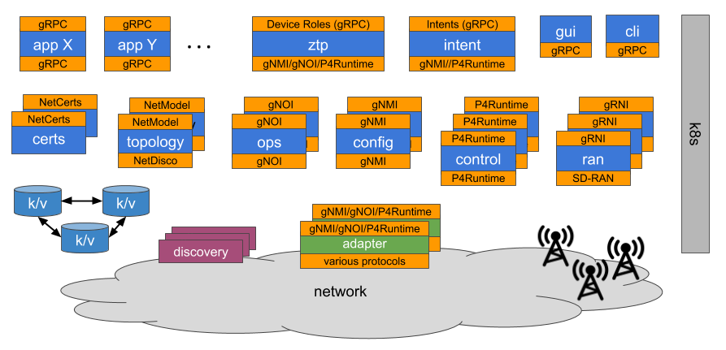

# Open Network Operating System (ONOS)

 

**µONOS** is a code-name for the next generation architecture of ONOS - an open-source SDN control and configuration platform.
The µONOS architecture is:

- Natively based on new generation of control and configuration interfaces and standards, e.g. **P4/P4Runtime**, **gNMI/OpenConfig**, **gNOI**
- Provides basis for zero-touch operations support
- Implemented in systems-level languages - primarily Go, some C/C++ as necessary
- Modular and based on established and efficient polyglot interface mechanism - gRPC
- Composed as a set of micro-services and deployable on cloud and data-center infrastructures - Kubernetes
- Highly available, dynamically scalable and high performance in terms of throughput (control/config ops/sec) and latency for implementing control-loops 
- Available in ready-to-deploy form with a set of tools required for sustained operation, e.g. Docker images, Helm charts, monitoring and troubleshooting tools, etc.

µONOS is based on our 5+ years of experience building and deploying ONOS which has been a leader in the SDN control plane space when it comes to high availability, performance and scalability. 
The platform enables comprehensive set of network operations:

- Configuration, monitoring and maintenance of network devices for zero touch operation
- Configuration and programming of the forwarding plane structure (forwarding pipelines specified in P4)
- Validation of network topology and of forwarding plane behaviour
- Efficient collection of fine-grained network performance metrics (INT)

## µONOS Deployment Architecture

## Additional Resources
### Talks at ONF Connect 2019
* [µONOS Project Overview](https://vimeo.com/360845205)
* [µONOS for Developers](https://vimeo.com/360846886)
* [Device Configuration in µONOS](https://vimeo.com/360886688)

