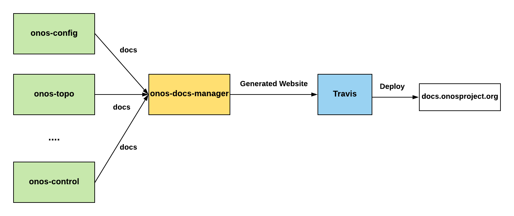

# How does onos-docs work? 
*Multi-repo docs* is a process that collects docs from multiple repos and publishes them on a single website. 
[µONOS](https://github.com/onosproject) project uses the Multi-repo docs process to achieve following design goals:

- *Distributed docs and a centralized representation*: Support **Documentation as Code** - store and version documentation alongside code, or in it's own version controlled repo for 
each subsystem. In addition, [onos-docs](https://github.com/onosproject/onos-docs) repo stores common documents (e.g. developer guidelines) and website related files
- *Easy to maintain*: Support adding new projects and their docs in the building and publishing process of onos docs with a minimum effort.
- *Versioning*: Support versioning to build different version of docs based on different releases of ONOS subsystems. 

## ONOS Docs Manager Software:
onos-docs project uses [Mkdocs] for building the docs website and [Travis] to publish it on web.  
To automate the workflow and  achieve the above design goals, 
a software is developed called *onos-docs-manager* that is written in Golang 
that automates the following functionalities:
 
- Collect docs from multiple repos, organize them, and build the onos-docs website
- Support versioning of multi-repo docs to build different version of docs based on different releases of ONOS subsystems. 
- Support dynamic navigation layout to change navigation layout automatically per version of docs

The onos-docs building and publishing process is illustrated as follows:


 
 
 **Note**: onos-docs-manager uses some of the utility functions that are implemented part of [structor](https://github.com/containous/structor) project.
 

## How to build and browse onos docs locally?
To build and browse onos docs locally, :

1. First, clone [onos-docs] repo using `git clone` or follow [dev_workflow](dev_workflow.md) to 
setup your workspace for onos-docs repo. 
2. To build and browse onos-docs locally run the following commands:
   ```bash
    $ cd onos-docs
    $ make docs-serve
    ```
3. Finally, open your browser and enter the following address:
*127.0.0.1:8000* to render onos docs website locally. 

**Note**: To build onos docs without rendering the website locally, run the following command:
```bash
make docs
``` 

## How does onos-docs-manager support versioning and dynamic navigation layout?
onos-docs-manager performs the following steps to build onos docs website related files for 
each version of onos docs:

1. Read and parse the information about each version of 
docs from a [config file](https://github.com/onosproject/onos-docs/blob/master/docs/configs/versions.yml).
2. Clone repos and build website (under `/site` directory) for each version of docs based on the given config file and 
   a specific navigation layout under [navigation layouts directory](https://github.com/onosproject/onos-docs/blob/master/docs/configs/nav) 
   

# Adding to documentation
Documents from the individual repositories of the µONOS project (e.g. onos-config,
onos-topo) should be maintained in those projects.

This documentation will be visible in GitHub for each of these projects
individually and also collectively in through **mkdocs** with the
**onos-docs** project at [onos-docs].

> Github and MkDocs (python based) each use their own renderer of Markdown to
> display the text in HTML.

Authors should ensure their Markdown should work in **both** situations. 

Rules for GitHub markdown are at [https://guides.github.com/features/mastering-markdown/](https://guides.github.com/features/mastering-markdown/)

Rules for MkDocs (Python) are at [https://daringfireball.net/projects/markdown/syntax](https://daringfireball.net/projects/markdown/syntax)

> The rules are mostly the same for both platforms, with the following caveats
>
>   * With the python interpreter there must be a new empty line before any ordered or unordered list


[onos-docs]: https://github.com/onosproject/onos-docs
[Mkdocs]: https://www.mkdocs.org
[Travis]: https://travis-ci.org/ 